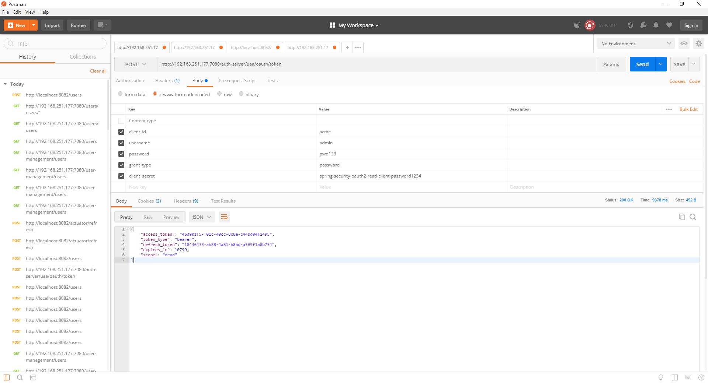
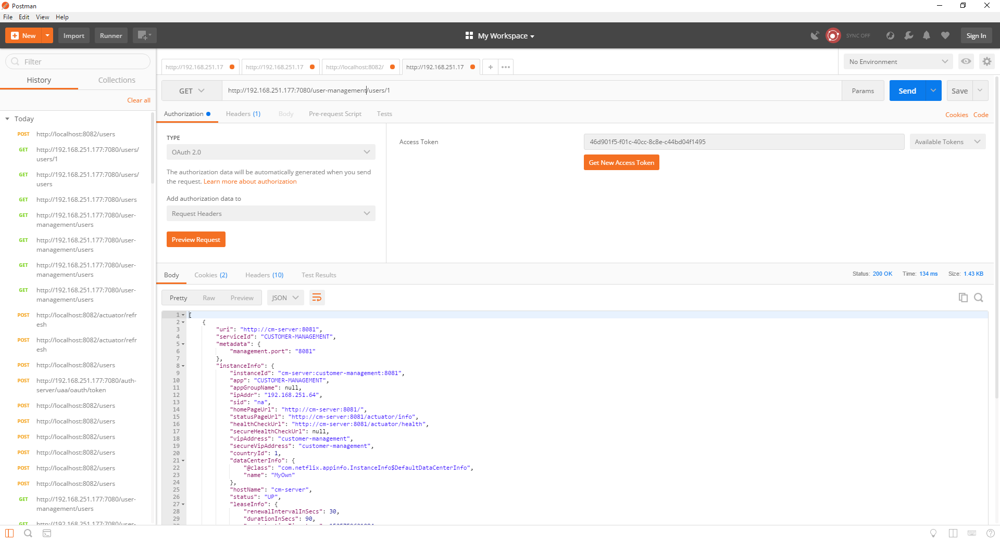

# spring-boot-microservices
A barebone tutorial on how to spring boot microservices using Neflix stack. This should be used only for demo purposes.

## Discovery Service

eureka-discovery-server project is a sample implementation of discovery service provided by Netflix Eureka

## Proxy Service

Zuul-proxy service is a sample implementation of zuul proxy service provided by Netflix. 

## Microservices

### customer-management

Customer management is one microservice that is discoverable via Eureka and can be accessed through Zuul Proxy

### user-management

User management is one microservice that is discoverable via Eureka and can be accessed through Zuul Proxy. This service uses eureka discovery to discover customer management and invokes one of its end points using Feign Client. 

The service also uses circuit breaker if the customer-management endpoint is not accessible. 

## configServer

This is a remote config server (native) implemented using spring cloud config and is used for remote configuration management for different microservices. 

## configFiles

Directory that stores different configuration files. 

## build

Stores docker compose files. Two files reflect 2 VMs on which different containers are hosted. One service is hosted on one container. 

## OAuth2 Servers

* Auhorization Server: 
  Auth-server is the authorization server that is used for providing the bearer tokens. 
* Resource Server: For demo purpose, only the user-management service has been converted to resource service (enabled Resource Server). 

*Token store between the authorization server and the resource server is shared via the JDBC Token Store.*

## Getting a token

HTTP 1.1  
Method: POST  
host: <ip>:7080  
URL: /auth-server/uaa/oauth/token  
Content-type: application/x-www-form-urlencoded  
Request Body:  
client_id=acme&username=admin&password=pwd123&grant_type=password&client_secret=spring-security-oauth2-read-client-password1234
 
Response:  

{
    "access_token": "46d901f5-f01c-40cc-8c8e-c44bd04f1495",
    "token_type": "bearer",
    "refresh_token": "18446433-ab88-4a81-b8ad-a569f1a8b754",
    "expires_in": 10799,
    "scope": "read"
}

* See Reference below in the image.

## Accessing a resource

HTTP 1.1  
Method: GET  
host: <ip>:7080  
URL: /user-management/users/1  
Authorization: Bearer <Access token>
 
Request Body: <empty>
 
Response:  
* Refer to the response in the below image:

You can connect me on linkedin@<a href="https://www.linkedin.com/in/sushant-jain-9829278/">here</a>
